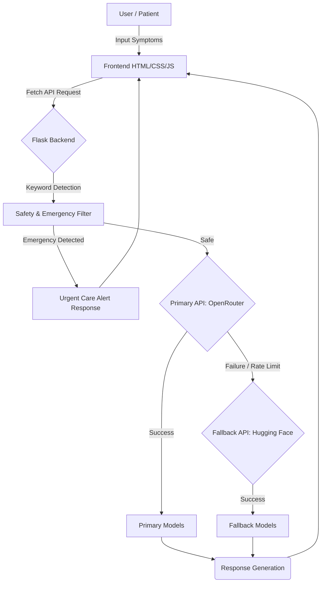

# AI Healthcare Symptom Checker

> **Status:** College Project / Educational Demonstration

A modern, responsive AI-powered healthcare chatbot built to provide educational medical guidance, detect emergency keywords, and demonstrate practical Large Language Model (LLM) integrations in healthcare using a robust fallback architecture.

**⚠️ IMPORTANT DISCLAIMER:** This application is for educational demonstration ONLY. It is not a clinical diagnosis tool and does not replace qualified medical advice.

## 🏗 System Architecture & Workflow

The application leverages a multi-tiered AI provider architecture utilizing Flask, HTML/JS, and multiple API providers to ensure high availability and safety.



## 🧠 AI Models & Providers

This project forces free-tier models and implements dynamic inference routing to maintain uptime.

### Primary Provider: OpenRouter

- **Default Model:** `google/gemma-3-4b-it:free`
- **Fallback Models Array:**
  - `liquid/lfm-2.5-1.2b-instruct:free`
  - `nvidia/nemotron-nano-9b-v2:free`
  - `arcee-ai/trinity-mini:free`
  - *(plus several other variants)*

### Secondary Provider: Hugging Face Inference API

- **Default Model:** `google/flan-t5-large`
- **Fallback Models Array:**
  - `mistralai/Mistral-7B-Instruct-v0.3`
  - `Qwen/Qwen2.5-7B-Instruct`

## 🛠 Tech Stack

- **Backend:** Python, Flask
- **Frontend:** HTML5, CSS3, Vanilla JavaScript
- **AI Integration:** OpenRouter API, Hugging Face Inference API

## 📂 Project Structure

```text
├── app.py                 # Flask server and API routes
├── chatbot.py             # AI provider integration and safety logic
├── requirements.txt       # Python dependencies
├── static/
│   ├── css/style.css      # Custom responsive UI styles
│   └── js/app.js          # Frontend interaction logic
└── templates/
    └── index.html         # Main web page layout
```

## 🚀 Getting Started

### Prerequisites

- Python 3.8+
- API Keys for OpenRouter and Hugging Face

### Installation

1. **Clone the repository and set up a virtual environment:**

   ```powershell
   python -m venv .venv
   .\.venv\Scripts\Activate.ps1
   ```

2. **Install dependencies:**

   ```powershell
   pip install -r requirements.txt
   ```

3. **Configure Environment Variables:**
   Create a `.env` file in the project root with your configuration:

   ```env
   OPENROUTER_API_KEY=your_openrouter_key_here
   OPENROUTER_MODEL=google/gemma-3-4b-it:free
   OPENROUTER_FALLBACK_MODELS=google/gemma-3n-e4b-it:free,liquid/lfm-2.5-1.2b-instruct:free,nvidia/nemotron-nano-9b-v2:free,arcee-ai/trinity-mini:free
   
   HUGGINGFACE_API_KEY=your_huggingface_key_here
   HUGGINGFACE_MODEL=google/flan-t5-large
   HUGGINGFACE_FALLBACK_MODELS=mistralai/Mistral-7B-Instruct-v0.3,Qwen/Qwen2.5-7B-Instruct
   
   FLASK_DEBUG=0
   FLASK_USE_RELOADER=0
   ```

4. **Run the application:**

   ```powershell
   python app.py
   ```

5. **Access the web interface:**
   Navigate to `http://127.0.0.1:5000` in your browser.

## ✨ Key Features

- **Modern UI/UX:** Clean, responsive design optimized for both desktop and mobile environments.
- **Robust AI Pipeline:** OpenRouter-first approach with automated Hugging Face fallback execution.
- **Safety First:** Real-time emergency keyword detection invoking immediate urgent-care guidance.
- **Live Feedback:** Asynchronous real-time chat interactions with dynamic loading states.
- **Demonstration Ready:** Includes sample prompt chips for rapid testing during live demos.
